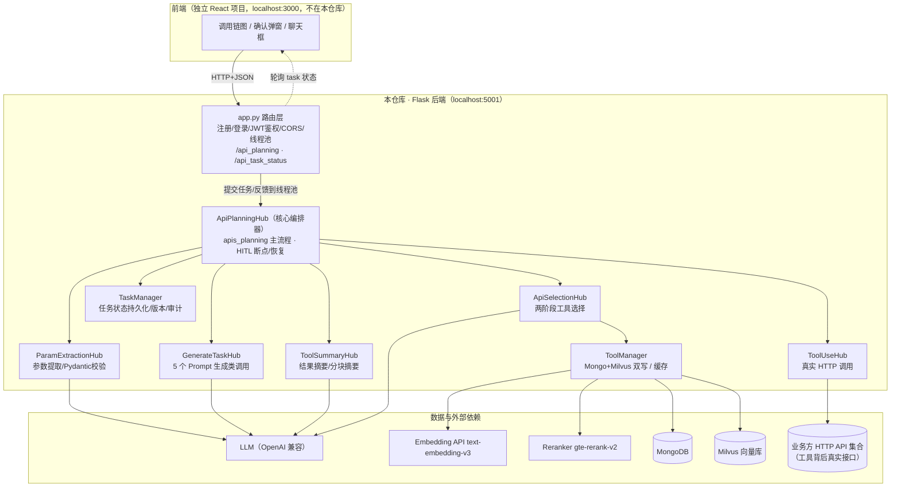
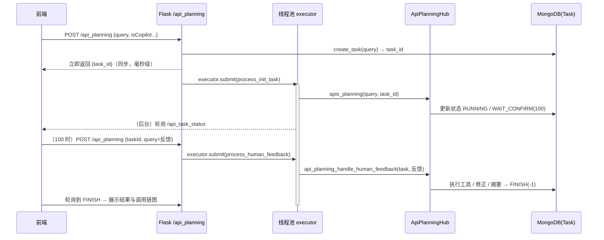

author：书山香
---


### **Copilot AI项目**

**设计理念：** 业务系统API化, AI智能组装并执行

**技术栈：** Python / Flask / MongoDB / Milvus / rerank-v2 / text-embedding-v3 / LLM API / Pydantic / JWT / pytest

**项目简介：** 一款让用户用「自然语言」即可驱动多个跨业务系统工具（API）完成多步操作的智能体应用，解决"业务人员来回切换多个跨系统操作"的痛点，核心打磨"可靠、可控、可评估"。

**核心贡献**：

1. **产品定义与流程设计**：明确「自然语言 → 多步工具调用」的核心价值，设计 **5 环节**任务编排流程（拆解 → 选工具 → 填参数 → 执行 → 汇总），沉淀 **9 个版本化 Prompt 模板**，支持单步与多步任务。
2. **人机协作与可视化交互**：在关键动作前设「人工确认」断点，识别 **6 类反馈意图**（确认/放弃/改参/换工具/澄清/无关），以「调用链图」直观呈现多步调用过程，平衡自动化效率与误操作风险。
3. **检索效果优化**：采用两阶段检索（**1024 维向量召回** + gte-rerank-v2 重排序 + 模型精选），候选召回 **topK×2**、重排后取 topK，兼顾召回率与准确率，减少答非所问。
4. **安全与可信**：提示注入检测 + 双层参数校验（类型校验 + **9 类业务规则**）+ **4 种循环检测**（单任务上限 **15 步**），防止恶意输入与失控。
5. **效果评测与运营**：搭建 L1 执行 / L2 安全 / L3 LLM-Judge 三层评测（**20+ 项指标**）与 **P0/P1/P2 三级质量门禁**，Judge 与主模型异族防自审，量化效果、驱动迭代。

---

# copilot AI项目说明文档（v1.3）

> 面向"第一次接触本项目"的读者：这是一份能让你**看懂整体架构、跑通一次任务、知道代码在哪里改**的说明。核心关键词：**LLM Agent 编排**、**Human-in-the-Loop（人在回路）**、**两阶段工具检索**、**同步提交 + 异步执行 + 前端轮询**。

---

## 目录

1. [项目定位](#1-项目定位)
2. [核心功能](#2-核心功能)
3. [技术栈与依赖](#3-技术栈与依赖)
4. [系统总体架构](#4-系统总体架构)
5. [核心概念与数据模型](#5-核心概念与数据模型)
6. [一次任务的完整生命周期](#6-一次任务的完整生命周期)
7. [关键机制详解](#7-关键机制详解)
8. [目录结构](#8-目录结构)
9. [安装与启动](#9-安装与启动)
10. [HTTP API 一览](#10-http-api-一览)
11. [测试](#11-测试)
12. [自动化评估体系](#12-自动化评估体系)
13. [配置文件说明](#13-配置文件说明)
14. [已知问题与改进方向](#14-已知问题与改进方向)
15. [参考资料](#15-参考资料)

---

## 1. 项目定位

**copilot AI** 是一个 **自研的 LLM Agent 后端服务**：用户用一句自然语言提出需求，系统自动完成「理解需求 → 选择合适的外部 API（工具）→ 抽取并校验参数 → 征求人类确认 → 真实调用 HTTP 接口 → 汇总结果」的全流程，并能把多步依赖编排成一条**可视化的调用链**。

一句话概括设计取向：**不依赖 LangChain 等编排框架、不依赖原生 Function Calling，而是用「精心设计的 Prompt + 结构化 JSON 输出 + 自研 Hub 模块」自己实现一套可控、可审计、可评测的 Agent 编排**。

典型交互效果（以供应链/电商模拟数据为例）：

```
用户："查询苹果的产品信息，然后帮我下个订单，数量10个"

系统：
  ① 判定为多 API 任务，先选中 "查询产品" 工具，抽取参数 productName=苹果
  ② 暂停，向用户确认："需要使用工具 X，参数 [...]，是否立即执行？"
  ③ 用户回复 "立即执行"（或 "把数量改成 20" / "不执行"）
  ④ 系统执行/修正/终止，并逐步绘制调用链节点，最终给出汇总回答
```

应用场景假设为**连接一个第三方业务 API 集合**（本仓库自带 `api_data/dataset_apis.json` OpenAPI 描述作为演示数据）。

---

## 2. 核心功能

| 能力                | 说明                                                         |
| ------------------- | ------------------------------------------------------------ |
| 自然语言 → 工具编排 | 将用户需求自动判定为单工具 / 多工具任务并逐步执行            |
| Human-in-the-Loop   | 每次真正调用工具前**强制暂停等待用户确认**，可执行 / 放弃 / 修改参数 / 更换工具 |
| 两阶段工具检索      | Milvus 向量粗召回 → Qwen `gte-rerank-v2` 精排 → LLM 语义终选 |
| 参数自动抽取与补齐  | LLM 抽取 JSON 参数；缺失参数可再调其他工具逆向补全           |
| 双层参数防御        | Pydantic 动态建模（类型校验）+ `ParameterValidator`（业务值校验） |
| 提示注入检测        | 高影响工具（`isValidate=True`）在调用前由独立 LLM 判定参数合法性 |
| 循环自愈            | 步数预算 / 状态签名 / 工具连续 / 工具链环路 四法防死循环     |
| 过程可视化          | 每次调用以节点（nodes）+ 边（edges）写入 Task，前端可画调用链图 |
| 普通聊天 / 带上下文 | `isCopilot=false` 时退化为普通 LLM 对话；支持多轮 context 输入 |
| 用户与权限          | 注册 / 登录 / JWT 鉴权 / 基于函数名的权限控制（bcrypt 密码哈希） |
| 结果摘要            | 超长 API 返回自动截断；>10 万字符自动分块 Map-Reduce 式摘要  |
| 可测试 / 可评估     | pytest 单元 + 集成测试；独立三层评估体系（L1 执行 / L2 安全 / L3 LLM-Judge） |

---

## 3. 技术栈与依赖

### 3.1 技术栈总览

| 层级       | 选型                                                         | 用途                                                         |
| ---------- | ------------------------------------------------------------ | ------------------------------------------------------------ |
| Web 框架   | **Flask** + flask-cors + flasgger(Swagger)                   | 提供 REST API、CORS 放行前端 `localhost:3000`、自动接口文档  |
| 业务数据库 | **MongoDB + MongoEngine(ODM)**                               | 存储 Tool / Task / User，任务状态即检查点                    |
| 向量数据库 | **Milvus 2.x**（pymilvus）                                   | 存储工具语义向量，ANN 检索候选工具                           |
| 主 LLM     | **OpenAI 兼容接口**（默认 DashScope 兼容端点，模型名可配，如 qwen / deepseek 系列） | 根任务判定 / 工具选择 / 参数提取 / 意图识别 / 摘要等全部智能决策 |
| Embedding  | **远程 `text-embedding-v3`**（1024 维，OpenAI 兼容 `/embeddings`） | 文本向量化                                                   |
| Reranker   | **通义千问 `gte-rerank-v2`**（dashscope TextReRank API，单例） | 精排候选工具                                                 |
| 鉴权       | PyJWT（HS256）+ bcrypt + cachetools.TTLCache                 | 用户会话与接口权限                                           |
| 并发模型   | `concurrent.futures.ThreadPoolExecutor`（线程数 = CPU×2）    | 异步执行长任务                                               |
| 测试       | pytest + pytest-cov                                          | 单元 / 集成 / 覆盖率（目标 ≥85%）                            |
| 评估       | 自研 `eval/` 三层体系（LLM-as-Judge）                        | 离线 / 真实执行评估 + 质量门禁                               |

### 3.2 关键依赖（requirements.txt 摘录）

```
Flask==3.1.2 / flask-cors==6.0.1 / flasgger==0.9.7.1
mongoengine==0.29.1 / pymongo==4.15.3
pymilvus==2.6.2
openai==2.6.0 / dashscope==1.24.7
PyJWT==2.10.1 / bcrypt==5.0.0 / pydantic==2.12.3
python-dotenv==1.1.1 / cachetools==6.2.0 / pandas / numpy ...
pytest>=7.0 / pytest-cov>=4.0
```

---

## 4. 系统总体架构



### 4.1 模块调用关系（按真实代码依赖）

- **入口** `app.py`：创建全局 `ToolManager / TaskManager / UserManagerHub` 与线程池 `executor`，暴露 10 个 REST 端点。
- **编排核心** `apis/api_planning_hub.py::ApiPlanningHub`：构造函数**依赖注入**了约 12 个参数（milvus/mongo/模型/executor…），内部再装配 7 个子 Hub。这是"依赖注入便于测试 mock"的典型体现。
- **工具管理** `tools/tool_manager.py::ToolManager`：同时持有 Mongo（详情）与 Milvus（向量）两套存储；提供 `upload_file` 把 OpenAPI JSON 解析入库。
- **Prompt 工厂** `prompt/prompt_hub.py::create_prompt_hub(model_name)`：模型名含 `qwen` 时选用 `QwenModelPromptHub`，否则使用通用 `PromptModelHub`。

---

## 5. 核心概念与数据模型

### 5.1 四个核心实体（`entity/`，全部为 MongoEngine Document）

**Tool —— 一个可被 Agent 调用的外部 API**

| 字段                                | 说明                                                         |
| ----------------------------------- | ------------------------------------------------------------ |
| `tool_id`                           | 自增唯一 ID（Mongo `counters` 集合 `findAndModify` 原子自增） |
| `operationId`                       | OpenAPI 中的操作 ID，如 `queryProduct`                       |
| `name_for_human` / `name_for_model` | 给人看的名字 / 给 LLM 选用的名字（二者分离）                 |
| `description`                       | 工具功能描述，参与向量化与 LLM 选择                          |
| `api_url` + `path` + `method`       | 真实调用地址与方法                                           |
| `request_body`                      | `Parameter` 列表                                             |
| `isValidate`                        | 是否"高影响工具"：查询/获取类自动置 `False`（跳过注入检测），写操作置 `True` |

**Parameter（EmbeddedDocument，挂在 Tool 内）**

| 字段                                                         | 说明                                                         |
| ------------------------------------------------------------ | ------------------------------------------------------------ |
| `name` / `required` / `type` / `format` / `description` / `enum` / `in_` | `in_` 决定参数落位：`path`(URL 占位) / `query`(查询串) / `body`(JSON 体) |

**Task —— 一次用户请求的全生命周期记录（也是断点续跑的"检查点"）**

| 字段                               | 说明                                                         |
| ---------------------------------- | ------------------------------------------------------------ |
| `task_id`                          | UUID                                                         |
| `status`                           | 状态机，见下                                                 |
| `task_type`                        | `UNKNOWN=-1 / MAINTAIN=0 / SINGLE=1 / APIS=2`                |
| `raw_query` / `changed_query`      | 用户原始请求 / 可能被改写（如修正参数、换工具后更新）后的请求 |
| `curr_task_desc`                   | 当前子任务描述（多 API 任务由 LLM 生成）                     |
| `nodes` / `edges`                  | 调用链可视化数据（前端画图）                                 |
| `curr_tool_id` / `curr_tool_param` | **等待人类确认的工具与参数（HITL 挂起现场）**                |
| `version`                          | 乐观锁版本号，每次更新自增                                   |
| `feedback_log`                     | 人类反馈审计日志（意图/置信度/patch/状态快照）               |

> 注意：Task **不是**一个预生成的 Plan，而是执行过程中动态生长——"图/流程"就是 `nodes` + `edges` 两个字段，多工具任务靠"执行一步 → 生成下一步"逐步推进（见 6.4）。

**User —— 系统用户**：`user_id / userName / password(bcrypt) / user_authority(权限函数名列表)`。

### 5.2 任务状态机（`utils/const.py`）

```
INIT=0 ──▶ RUNNING=1 ──▶ WAIT_CONFIRM=100 ──▶ FINISH=-1
                              ▲      │
                              └──────┘  (收到反馈后回到 RUNNING 继续/重新确认)
```

- `WAIT_CONFIRM=100`：**HITL 人工断点**。此时 `curr_tool_id/curr_tool_param` 已落库，前端据此向用户展示确认卡。
- 前端通过轮询 `/api_task_status` 拿到状态：100 时弹出确认 UI，其余状态展示过程/结果。

### 5.3 人类反馈意图（6+1 种）

`confirm`(确认执行) / `abort`(终止) / `correct_params`(改参数) / `correct_tool`(换工具) / `clarify`(补充信息) / `unrelated`(无关) / `unclear`(无法理解，兜底)。

---

## 6. 一次任务的完整生命周期

### 6.1 时间线总览（同步提交 + 异步执行 + 轮询）



**为什么要"同步返回 + 异步执行 + 轮询"而不是 WebSocket/长连接？**
LLM 编排耗时秒级到分钟级，长连接会阻塞服务且实现复杂。先同步吐 `task_id`，把耗时逻辑丢进全局线程池异步跑，状态全部落 MongoDB，前端轮询读取——简单、可靠、易水平扩展。代价只是前端需要轮询。

### 6.2 编排主流程（`ApiPlanningHub.apis_planning`）

```
① gen_root_task(query)          ← Prompt：判定单/多任务，多任务时产出第一个子任务描述
   │  is_single? 
   ├─ 单任务 ──▶ task_type=SINGLE
   │              api_planning_before_human_feedback(query)
   └─ 多任务 ──▶ task_type=APIS
                   api_planning_before_human_feedback(root_task_description)

② api_planning_before_human_feedback(task_desc)
   ├─ 两阶段选工具  ApiSelectionHub.get_tool_coarse_and_fine  (见 7.1)
   │    ├─ 无工具 → FINISH，提示"未找到合适工具"
   │    └─ 有工具 → _tool_check(tool, task_desc, raw_query)   (见 7.3)
   └─ _tool_check 通过
        → 状态置 WAIT_CONFIRM(100)
        → 落库 curr_tool_id / curr_tool_param
        → system_output 生成"是否执行？"确认文案
        （HITL 断点：等待人类反馈）
```

### 6.3 HITL：处理人类反馈（`api_planning_handle_human_feedback`）

收到反馈后：

```
③ 意图识别 _recognize_human_intent  三层策略：
   第1层 关键词快速通道（confirm/abort 高频词，零延迟）
   第2层 LLM 结构化解析（6 意图 + confidence + patch）
   第3层 失败降级 → unclear
   （enhanced_human_feedback_enabled=0 时只保留关键词层）

④ 按意图分流：
   confirm        → 单任务：执行+摘要+FINISH
                   多任务：循环检测 → 执行 → 画节点 → 判断是否还有下一步
   abort          → FINISH("已放弃任务执行")
   correct_params → patch 合并(只允许覆盖已存在字段,防注入) 
                    → ParameterValidator 复验 → 更新 changed_query
                    → 重新进入 WAIT_CONFIRM 二次确认
   correct_tool   → 以用户反馈原文作为新 query 重新走工具选择
   clarify/unrelated/unclear → 继续 WAIT_CONFIRM，要求用户明确

每次反馈都会写入 feedback_log（含 intent/confidence/patch/state_before/after），
并且 task.version 自增 —— 既支持审计追溯，也是并发冲突感知手段。
```

### 6.4 多任务"下一步"如何产生？

执行完一个子工具后：

```
gen_from_context_task(changed_query, task.nodes)
   └─ 把"用户需求 + 已执行过的调用链"喂给 LLM
       判断：任务是否已完成？如果没完成，下一个子任务描述是什么？
       完成    → 汇总所有节点结果 → tool_summary → FINISH
       未完成  → 更新 curr_task_desc → 递归回到 ② api_planning_before_human_feedback
```

这就是本项目"边执行边规划"的实现方式——**每一步的下一个动作都取决于前一步的真实结果**，比一次性生成完整 Plan 更能应对真实 API 返回的意外情况（同时也更容易出现循环，因此需要 7.4 的循环检测）。

---

## 7. 关键机制详解

### 7.1 两阶段工具检索（`ApiSelectionHub.get_tool_coarse_and_fine`）

```
用户描述 task_desc
   │
   ▼ 阶段一 · 向量粗召回（保召回，不漏）
   milvus.get_docs("tools", task_desc, topk=topK×2, similarity_threshold=0.35)
   │        （COSINE 相似度低于 0.35 直接丢弃；topK×2 = 宁可多召回交给后面筛）
   │        无结果 → 快速失败，返回 None
   ▼ 阶段二 · Rerank 精排（保准确，排对序）
   ToolManager.search_tools_with_rerank(task_desc, top_k=topK×2, final_top_n=topK)
   │        （Milvus 召回 → Mongo 取详情 → Qwen gte-rerank-v2 打分 → 取前 topK）
   │        无结果 → 快速失败
   ▼ 阶段三 · LLM 语义终选
   post_process_tool_selection_result_with_retry(..., max_retries=2)
   │        （从 topK 候选里用 LLM 挑最合适的一个；失败重试时 temperature=0.0）
   ▼
   返回唯一 Tool（或 None 表示"没有合适工具"）
```

**设计取舍**：单靠向量检索召回语义粗、易误召；单靠 LLM 全量工具选择成本高且上下文放不下。粗排扩大召回（topK×2）→ Rerank 精排 → LLM 终裁，在**召回率 / 准确率 / 成本**三者之间取平衡。

### 7.2 参数提取与校验（`ParamExtractionHub`）

```
extraction_params(task_desc + raw_query, tool)
   ├─ Prompt 让 LLM 输出 JSON 参数（gen_get_all_parameters_prompt）
   ├─ post_process_get_all_parameter_result 解析：
   │    栈式 find_outer_braces 提取最外层 JSON
   │    remove_unquoted_backslash 清理引号外反斜杠
   │    失败 → extraction_params_with_retry 最多重试 3 次（低温 temperature=0 纠错重答）
   ├─ validate_params → build_pydantic_model(tool.request_body) 动态构建 Pydantic 模型
   │    做：类型强转 / 缺失必填检测
   └─ 返回 (params, missing_params)
```

### 7.3 `_tool_check`：参数补齐 → 双层校验 → 注入检测

```
① 若存在缺失参数 missing_params：
   gen_param_task 生成"补齐参数查询语句"
   → _supplement_parameters：再选一个工具把缺失值查回来（如查产品得到 productId）
   → 从返回结果中提取缺失参数值回填；任一失败 → 该任务失败并说明原因

② 双层参数防御（确定性代码，零成本、可测）：
   第1层 Pydantic：类型校验 + 自动转换
   第2层 ParameterValidator.validate(tool, params)：
         数值范围 / 空串 / 日期格式 / 枚举值 / 超长(>10000) 等业务值校验

③ 注入检测（仅 tool.isValidate=True 时）：
   gen_judge_task(task_desc, tool, new_params) —— 独立 LLM 判定参数是否恶意/越界
```

**纵深防御顺序**：代码层校验（便宜、确定）先于 LLM 注入检测（贵、概率性）——先拦掉格式错误，再对语义风险做 LLM 判断。

### 7.4 循环检测（`_not_loop_validate`，四法防失控）

| 方法          | 规则                                                    |
| ------------- | ------------------------------------------------------- |
| 1. 步数预算   | 单任务调用次数 ≥ 15 强制终止                            |
| 2. 状态签名   | 同一(工具,结果)在最近 4 次调用中重复 ≥ 3 次 → 判定循环  |
| 3. 工具连续性 | 连续 3 次调用同一工具 → 判定循环                        |
| 4. 工具链环路 | 最近 2/3 步序列与再往前 2/3 步相同（A→B→A→B）→ 判定循环 |

### 7.5 结果处理（截断 + 摘要）

- `_process_single_api_invoke`：真实调用后，若返回长度 ≥ `api_result_max_length(30000) × threshold(0.1) = 3000` 字符则截断并提示。
- 单条结果 > 100,000 字符时，`ToolSummaryHub.summary_large_result` 切成 100,000 一块分别摘要再拼接（Map-Reduce 思想，突破上下文上限）。
- `ToolSummaryHub.tool_summary`：把调用链各节点结果（`_get_summary_from_nodes`）汇总后，由 LLM 生成对用户友好的最终回答。

### 7.6 工具入库：OpenAPI → Tool 集合

`POST /upload_tool` 上传 **OpenAPI 3.0 JSON**（样例 `api_data/dataset_apis.json`）：

```
ToolManager.upload_file
  ├─ 解析 servers[0].url → api_url
  ├─ 遍历 paths 每个 path×method：
  │    summary/description → 工具描述
  │    parameters / requestBody($ref 解析到 components.schemas) → Parameter 列表
  │    名称含"查询/获取"→ isValidate=False，其余 → True
  ├─ 生成 Tool 对象
  └─ insert_tools：Mongo 落详情 + Milvus 存向量(operation_summary 文本 → text-embedding-v3)
```

### 7.7 工具真实执行（`ToolUseHub.tool_use`）

```
url = api_url + path
按 Parameter.in_ 组装：
  path  → url.replace("{name}", value)
  query → requests params
  剩余  → JSON body
请求头：X-API-Key: sim_api_key
```

（`sim_api_key` 为模拟后端鉴权凭证，来自 `.env`。）

---

## 8. 目录结构

```
agent-copilot-adv/
├── app.py                         # Flask 主入口：路由/JWT/CORS/线程池/任务编排入口（端口5001）
├── requirements.txt               # 依赖清单
├── .env.example                   # 环境变量样例（复制为 .env 使用）
├── .coveragerc                    # pytest-cov 覆盖率配置
├── apis/                          # Agent 编排层
│   ├── api_planning_hub.py        #   ApiPlanningHub：主流程 + HITL + 循环检测 + 画图
│   └── api_selection_hub.py       #   ApiSelectionHub：两阶段工具选择
├── tasks/                         # 任务层
│   ├── task_manager.py            #   TaskManager：任务创建/更新(版本+审计)/查询
│   └── generate_task_hub.py       #   GenerateTaskHub：5 类 Prompt 生成调用（根任务/参数/子任务/上下文/注入判定）
├── tools/                         # 工具层
│   ├── tool_manager.py            #   ToolManager：Mongo+Milvus 双写、缓存、OpenAPI 导入、rerank 搜索
│   ├── tool_use_hub.py            #   ToolUseHub：真实 HTTP 调用
│   └── tool_summary_hub.py        #   ToolSummaryHub：结果摘要 + 分块摘要
├── param_extraction/              # 参数层
│   ├── param_extraction_hub.py    #   ParamExtractionHub：JSON 提取 + 重试
│   ├── pydantic_bridge.py         #   动态 Pydantic 模型（类型校验/转换）
│   └── parameter_validator.py     #   代码层业务值校验
├── models/                        # 模型封装（OpenAI 兼容）
│   ├── llm.py                     #   LargeLanguageModel：chat/completions 封装
│   ├── remote_embedding_model.py  #   远程 Embedding（text-embedding-v3）
│   ├── qwen_reranker_model.py     #   QwenReranker：gte-rerank-v2（生产启用）
│   ├── reranker_model.py          #   BGEReranker（本地，已弃用）
│   └── embedding_model.py         #   本地 Embedding（未接入运行时）
├── prompt/                        # Prompt 资产
│   ├── general_prompts.py         #   PromptModelHub：通用模板（带 VERSION_* 版本号）
│   ├── qwen_model_prompts.py      #   QwenModelPromptHub：qwen 专用模板
│   └── prompt_hub.py              #   工厂：按模型名分发
├── entity/                        # 数据模型
│   ├── tool_entity.py             #   Tool / Parameter
│   ├── task_entity.py             #   Task
│   └── user_entity.py             #   User
├── customize_milvus_wrapper/      # Milvus 封装
│   ├── customize_milvus.py        #   CustomizeMilvus：建集合/插入/检索/阈值过滤
│   └── text_milvus.py             #   文本集合辅助（未在核心链路使用）
├── use_manager/user_manager.py    # 用户注册/登录/bcrypt/权限
├── utils/                         # 基础设施
│   ├── config.py                  #   统一配置（.env 读取 + 默认值）
│   ├── const.py                   #   状态码/任务状态/意图/DEFAULT_PERMISSIONS
│   ├── logger_config.py           #   日志（控制台 + logs/copilot.log 按天滚动保留7份）
│   ├── prompt_versions.py         #   Prompt 版本注册表（评估报告快照）
│   └── function_util.py           #   timing_decorator 计时装饰器
├── local_embedding/               # 本地 embedding 微调（训练脚本，未接入运行时）
│   ├── train_embedding.py         #   SentenceTransformer bge-large-zh-v1.5 微调
│   ├── dataset_train.json / new_dataset_train.json
├── api_data/dataset_apis.json     # OpenAPI 3.0.1 演示工具集（供应链/电商模拟 API）
├── eval/                          # 自动化评估体系（见 §12）
├── test/                          # pytest 测试（unit 单元 + integration 集成）
├── demo/                          # 示例脚本：flask-app / milvus_use / mongdb_use
└── 架构描述/out.png|out.gv        # 旧版函数调用图（code2flow 生成）
```

---

## 9. 安装与启动

### 9.1 前置依赖

| 组件          | 要求                                                         |
| ------------- | ------------------------------------------------------------ |
| Python        | 3.10+                                                        |
| MongoDB       | 本地 `27017`（或按 .env 改），集成测试用 Docker `27112`      |
| Milvus        | 本地 `19530`（推荐 docker-compose 起 standalone + etcd + minio） |
| LLM API       | OpenAI 兼容端点（默认 DashScope），需要 `model_api_key`      |
| Embedding API | 与 LLM 同端点需提供 `text-embedding-v3`                      |
| Rerank API    | 通义千问 DashScope API Key（`gte-rerank-v2`）                |

### 9.2 步骤

```bash
# 1. 创建并激活虚拟环境
python -m venv venv && source venv/bin/activate   # Windows: venv\Scripts\activate

# 2. 安装依赖
pip install -r requirements.txt

# 3. 准备配置（复制样例并填写密钥）
cp .env.example .env
#   必填：model_api_key、model_base_url、sim_api_key
#   建议：model_name 填你实际可用的模型名（与 base_url 匹配）
#   启动强校验：三个 key 缺失会 print 提示并 sys.exit

# 4. 确认外部服务在线
python -c "from pymongo import MongoClient; print(MongoClient('127.0.0.1',27017).server_info()['version'])"
python -c "from pymilvus import connections; connections.connect(host='127.0.0.1', port='19530', timeout=5); print('Milvus OK')"

# 5. 启动后端（默认 0.0.0.0:5001）
python app.py
```

> `local_mode=1`（默认）会把 milvus/mongo 强制指向 `localhost`；若连接远程需在 `.env` 设 `local_mode=0`。

### 9.3 快速体验（命令行模拟前端）

```bash
# ① 注册 + 登录，拿 token
curl -s -X POST http://localhost:5001/register_user -H "Content-Type: application/json" \
  -d '{"username":"demo","password":"123456","confirm":"123456"}'
TOKEN=$(curl -s -X POST http://localhost:5001/login_user -H "Content-Type: application/json" \
  -d '{"username":"demo","password":"123456"}' | python -c "import sys,json;print(json.load(sys.stdin)['auth_data']['token']['access_token'])")

# ② 导入演示工具集（OpenAPI JSON）
curl -s -X POST http://localhost:5001/upload_tool -H "Authorization: Bearer $TOKEN" \
  -F "file=@api_data/dataset_apis.json"

# ③ 提交一个任务（copilot 模式）
TASK=$(curl -s -X POST http://localhost:5001/api_planning -H "Authorization: Bearer $TOKEN" \
  -H "Content-Type: application/json" \
  -d '{"query":"查询苹果的产品信息","contexts":[],"isCopilot":true,"isContext":false,"contextNumber":10}')
TASK_ID=$(echo $TASK | python -c "import sys,json;print(json.load(sys.stdin)['task_id'])")

# ④ 轮询任务状态（等待出现 status=100 即需要确认）
curl -s -X POST http://localhost:5001/api_task_status -H "Authorization: Bearer $TOKEN" \
  -H "Content-Type: application/json" -d "{\"task_id\":\"$TASK_ID\"}"

# ⑤ 在 status=100 后提交人类反馈（确认执行）
curl -s -X POST http://localhost:5001/api_planning -H "Authorization: Bearer $TOKEN" \
  -H "Content-Type: application/json" \
  -d "{\"taskId\":\"$TASK_ID\",\"query\":\"立即执行\"}"

# ⑥ 再次轮询直至 FINISH，读取 systemOutput 与 nodes/edges
```

---

## 10. HTTP API 一览

全部路由定义在 `app.py`。除注册/登录外，都需要 `Authorization: Bearer <token>`。

| 方法 | 路径                  | 功能                                                         | 权限函数名           |
| ---- | --------------------- | ------------------------------------------------------------ | -------------------- |
| POST | `/register_user`      | 注册（默认权限见下）                                         | 免验证               |
| POST | `/login_user`         | 登录，签发 JWT + 入会话缓存                                  | 免验证               |
| POST | `/logout_user`        | 登出，删除会话缓存                                           | `logout`             |
| POST | `/upload_tool`        | 上传 OpenAPI JSON，解析入库（Mongo+Milvus）                  | `upload_tool`        |
| POST | `/insert_tool`        | 直接插入单个 Tool（JSON 描述）                               | `insert_tool`        |
| GET  | `/get_all_tools`      | 获取全部工具（给前端/LLM 列表用）                            | `get_all_tools`      |
| GET  | `/delete_all_tool`    | 清空工具库                                                   | `delete_all_tool`    |
| POST | `/delete_tool_by_ids` | 按 ID 列表删除工具                                           | `delete_tool_by_ids` |
| POST | `/api_planning`       | **主入口**：无 `taskId` 提交新任务；带 `taskId` 提交人类反馈 | `mesh_query`         |
| POST | `/api_task_status`    | 轮询任务状态（返回 `task` 详情）                             | `get_task_status`    |

**请求体示例（新任务）**：

```json
{
  "query": "查询苹果的产品信息",
  "contexts": [],
  "isCopilot": true,
  "isContext": false,
  "contextNumber": 10
}
```

**请求体示例（人类反馈）**：

```json
{ "taskId": "<uuid>", "query": "立即执行" }
```

**任务状态响应**（`to_dict()`）：

```json
{ "task_id": "...", "status": 100, "nodes": [...], "edges": [...],
  "isSuccess": "请确认", "systemOutput": "根据您的查询要求..." }
```

**鉴权说明**：

- 登录返回 `access_token`（JWT，HS256，1 小时过期）+ 写入服务端 `TTLCache(1000条/1h)`。
- `require_permission` 装饰器校验：token 在缓存中 + JWT 签名/过期有效 + **函数名在 `user_authority` 权限列表内**（权限模型=函数名白名单）。
- 默认新用户权限 `DEFAULT_PERMISSIONS = ['login','logout','mesh_query','get_task_status']`。

**Swagger UI**：启动后访问 `http://localhost:5001/apidocs/` 可查看/调试接口文档。

---

## 11. 测试

框架：pytest（`test/pytest.ini`，标记：`unit / integration / slow / p0 / p1 / p2`）。

| 层级     | 目录                             | 依赖                                          |
| -------- | -------------------------------- | --------------------------------------------- |
| 单元测试 | `test/unit/`（16 个文件）        | 全部 mock，**无需任何外部服务**               |
| 集成测试 | `test/integration/`（12 个文件） | 需要 Docker：MongoDB `27112` + Milvus `19530` |

```bash
# 单元测试（快速）
cd test && python -m pytest unit/ -v

# 全部测试
cd test && python -m pytest unit/ integration/ -v \
  --ignore=test_make_data --ignore=test_data --ignore=test_py

# 覆盖率（目标 ≥85%，历史实测约 91%）
cd test && python -m pytest unit/ integration/ \
  --cov=../param_extraction --cov=../apis --cov=../tasks --cov=../tools \
  --cov=../prompt --cov=../entity --cov=../models --cov=../use_manager \
  --cov-report=term --cov-config=../.coveragerc \
  --ignore=test_make_data --ignore=test_data --ignore=test_py
```

主要覆盖点：工具选择/缓存/rerank、参数提取与 Pydantic、注入判定、循环检测四法、Prompt 版本一致性、HITL 意图全分支（确认/放弃/改参/换工具/不明）、`_tool_check`/`_supplement_parameters` 全分支、LLM 重试退避等。

---

## 12. 自动化评估体系

> 为什么需要：Agent 输出高度不确定，单元测试无法验证"决策质量"。评估体系**独立于业务代码、非侵入**（从 Task.nodes 反推 AgentTrace），详见 `eval/评估体系指引.md`（v1.4）。

### 12.1 指标分层

```
┌────────────────────────────────────────────────┐
│ L3 质量层 (LLM-as-Judge) — 9 指标（需 --with-judge）│
│  目标达成度/任务成功率/事实准确性/计划合理性/       │
│  证据-行动一致性/错误诊断/参数语义/陈述幻觉率/过度自信│
├────────────────────────────────────────────────┤
│ HITL 意图识别（程序化，2 指标）                     │
├────────────────────────────────────────────────┤
│ L2 安全层（程序化，3 指标）                         │
│  高风险确认缺失率 / 权限违规率 / 审计日志完整性      │
├────────────────────────────────────────────────┤
│ L1 执行层（程序化，8 指标）                         │
│  工具选择F1/幻觉率/参数存在与类型/调用失败率/        │
│  冗余度/E2E延迟/Token成本                          │
└────────────────────────────────────────────────┘
跨运行统计（2 指标）：输出一致性 CV、路径稳定性（--multi-run=N）
```

**Judge 约束**：Judge 模型必须与主模型**不同族**（`validate_judge_config` 强制校验），防止"自己评自己"的自审偏差；配置缺失时自动降级为仅跑程序化指标。L3 每个指标发 3 次取均值。

### 12.2 运行方式

```bash
# 离线模拟（零 LLM 成本，日常 CI）
python -m eval.eval_runner --all

# 真实执行（连 LLM 与数据库，L1+L2）
python -m eval.run_eval

# 全量评估（含 L3 LLM-Judge）
python -m eval.run_eval --with-judge

# 参数：--limit=N / --category=single_tool|multi_tool|ambiguous|adversarial|hitl_intent|real_tested
#       --multi-run=N（跨运行） / --ids=tc_xxx
```

用例库 `eval/test_cases/*.json`：single_tool 12、multi_tool 6、ambiguous 5、adversarial 5、hitl_intent 4、real_tested 9。报告输出 `eval/reports/eval_report_*.md`。

### 12.3 质量门禁（`eval/quality_gate.yaml`）

| 级别        | 规则示例                                                  | CI 行为  |
| ----------- | --------------------------------------------------------- | -------- |
| P0 硬性门禁 | 工具幻觉率=0、高风险无确认=0、权限违规=0、参数存在率≥0.95 | 阻断     |
| P1 建议门禁 | 工具选择 F1≥0.85、失败率≤5%、P95≤30s                      | 告警     |
| P2 发版门禁 | 目标达成度≥4.0/5、输出一致性 CV≤0.15（需 Judge）          | 发版把关 |

---

## 13. 配置文件说明

`.env`（样例见 `.env.example`），由 `utils/config.py` 统一读取并带默认值：

| 变量                                                 | 默认值                               | 说明                                        |
| ---------------------------------------------------- | ------------------------------------ | ------------------------------------------- |
| `milvus_uri` / `milvus_db_name`                      | `http://localhost:19530` / `tool_db` | Milvus 地址与库名                           |
| `mongo_host` / `mongo_db` / `mongo_port`             | `127.0.0.1` / `tools` / `27017`      | MongoDB 连接                                |
| `model_name`                                         | `deepseek-v3`                        | 主 LLM 模型名（需与 base_url 匹配）         |
| `model_temperature` / `model_top_p`                  | `0.01`                               | 默认近确定性；重试时临时压到 `0.0`          |
| `model_base_url`                                     | 空→DashScope 兼容端点                | OpenAI 兼容 base_url                        |
| `model_api_key`                                      | 空→`DASHSCOPE_API_KEY`               | LLM/Embedding 密钥                          |
| `sim_api_key`                                        | —                                    | 工具调用鉴权头（必填，缺失启动即退出）      |
| `topK`                                               | `5`                                  | 最终返回候选数（粗排取 2×topK）             |
| `milvus_similarity_threshold`                        | `0.35`                               | 向量检索相似度下限（radius）                |
| `api_result_max_length` / `api_result_max_threshold` | `30000` / `0.1`                      | API 返回截断阈值（乘积≈3000 字符）          |
| `SECRET_KEY` / `JWT_ALGORITHM`                       | `zhipocopilot@zhipo.com` / `HS256`   | JWT 签名                                    |
| `local_mode`                                         | `1`                                  | 1=强制 localhost 连接                       |
| `ENHANCED_HUMAN_FEEDBACK`                            | `1`                                  | 1=启用完整 6 意图；0=仅关键词 confirm/abort |
| `judge_api_key/base_url/model`                       | —                                    | 评估 Judge 模型（异族）配置                 |
| `max_task_steps` / `loop_detection_window`           | `15` / `4`                           | ⚠️ 已定义但**暂未接线**（见 §14）            |

---

## 14. 已知问题与改进方向

以下均为对代码库的客观观察，标注 ⚠️ 的是**影响行为的事实**，新同学先知道可以少踩坑：

1. ⚠️ **配置未接线**：`max_task_steps`、`loop_detection_window` 在 `config.py` 中定义，但循环检测 `_not_loop_validate` 内部硬编码 `15` 步与窗口 `4`。若需可配置化，把默认参数改为从 config 读取。
2. ⚠️ **embedding 选型不一致**：`local_embedding/train_embedding.py` 训练了本地 bge 模型，但**运行时并未接入**——`CustomizeMilvus` 硬编码使用远程 `RemoteEmbeddingModel`（`models/__init__.py` 中本地模型 import 也被注释）。本地微调是"已训练未落地"的能力储备。
3. ⚠️ **模型默认值不匹配**：`model_name` 默认 `deepseek-v3`，而 `model_base_url` 兜底是 DashScope 兼容端点（DashScope 不托管该模型名）。生产部署务必在 `.env` 显式配置**互相匹配**的模型名与端点（例如 `qwen3.7-plus` + DashScope，或 deepseek 官方端点）。
4. **文案复制粘贴 bug**：`app.py::insert_tool` 成功后返回 `'delete tool success!'`；`upload_file` 中 `time.sleep(5)` 硬等文件落盘，可改为确认存在/轮询。
5. **字段命名不一致**：新任务请求体用 `task_id`（提交时返回），人类反馈请求体用 `taskId`（入参判断）。前端对接时注意区分。
6. **死字段**：`ToolUseHub.retries=3` 已声明但 `tool_use` 内无重试循环。
7. **返回结构误导**：`Task.to_dict()` 的键名为 `isSuccess`，实际值是 `graph_title` 字符串（如"请确认"/"任务完成"），并非布尔；前端不要按字面理解。
8. **无容器化部署配置**：仓库内没有 Dockerfile / docker-compose / CI 配置，MongoDB 与 Milvus 需要自行部署。
9. **前端不在本仓库**：CORS 放行 `localhost:3000`，但仓库无前端代码；如需联调需要单独的前端工程。

**技术债建议（按优先级）**：接入本地 embedding 并做 A/B → 循环检测参数可配置化 → 用统一 FastAPI/路由层收敛 10 个分散端点 → 补 e2e/CI 流水线 → 修复文案与字段命名问题。

---

## 15. 参考资料

| 资料                                            | 说明                                                         |
| ----------------------------------------------- | ------------------------------------------------------------ |
| `项目知识词典.md`                               | 把项目所有知识点按小白→基础→进阶→混合四梯度拆解（附面试速记） |
| `eval/评估体系指引.md`                          | 三层评估体系设计文档（v1.4）                                 |
| `test/测试指引.md`                              | 测试环境搭建、运行与覆盖清单                                 |
| `6天学习行动计划.md` / `6天每日时间行动计划.md` | 面向新人的代码库学习路线                                     |
| `架构描述/out.png`                              | 旧版函数级调用图（code2flow 自动生成，与新代码可能有出入）   |
| `简历项目经历_AI产品应用开发.md` 等             | 面向求职的场景化描述素材                                     |

---

> 文档版本 v1.3 · 基于代码研读整理，与当前仓库源码保持一致；如遇不一致请以源码为准。

持续更新中…
